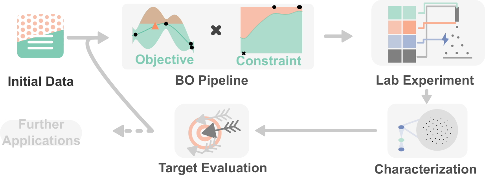

## Constrained Composite Bayesian Optimization (CCBO)

- [Overview](#overview)
- [Getting started](#getting-started)
- [Installation](#installation-guide)
- [Running Demo](#running-the-notebook)
- [License](#license)
- [Contact](#contact)

# Overview
This project involves the implementation of CCBO based on Gaussian Process (GP) models using [GPyTorch](http://www.gpytorch.ai/) and [BoTorch](https://botorch.org) for guided experimentation. 

This code repository includes two notebooks demonstrating the implementation of CCBO for benchmarking and guiding lab experiment. For detailed information, see the [Getting Started](#getting-started) section.

## How does it work to guide experiment?



# Getting Started
CCBO requires python environment to work. To get started with CCBO, follow these steps:

## System Requirements
### Hardware
The source code provided for CCBO does not require any specific hardware. For ideal performance, we recommend RAM of 16 GB and at least a 4-core CPU.
### Software 
The code haven been tested on *macOS Sonoma (14.4.1)*, *Windows 10/11*, and *Linux (Ubuntu 16.04)*. It is recommended to have package management software such as [Conda](https://www.anaconda.com/download/success).

### Python Dependencies
To run the notebooks and scripts in this project, you will need the following Python dependencies:
- `python = 3.9`
- `botorch == 0.10.0`
- `gpytorch == 1.11`
- `numpy == 1.23`
- `pandas`
- `seaborn`
- `joblib`
- (optional)`tqdm`

## Installation Guide
The typical installation time should be less than 10 min. To begin, install the required dependencies by running the following commands in your Terminal (make sure you have [Conda](https://www.anaconda.com/download/success) already installed). 

Due to compatibility issues, it is recommended to create a virtual environment first:
```bash
conda create -n ccbo python=3.9
conda activate ccbo
```
Next, use `pip` to easily install BoTorch and all dependencies. **Be aware to use the pip from the new virtual environment**, you can refer to [this](https://stackoverflow.com/questions/41060382/using-pip-to-install-packages-to-anaconda-environment) post to make sure you did not install BoTorch into your global Python.
```bash
python -m pip install botorch==0.10.0 seaborn numpy==1.23 pandas joblib
```
Finally, clone this repository to your local machine:
```bash
git clone https://github.com/FrankWanger/CCBO.git
```
## Running the notebook to reproduce results
There are two demo notebooks to reproduce the experiments included in the manuscript. If you are not familiar with Jupyter notebooks, please refer to [this](https://docs.jupyter.org/en/latest/running.html) guide.

`CCBO_benchmark.ipynb` A notebook showing benchmarking CCBO against vanilla BO, constrained BO, and random baseline with a synthetic electrospray problem. The same initial dataset has been provided in the notebook.

The parameters that are related to reproducing the results in the manuscript are:
- `ITERS`, the total number of iterations, the default is `10` 
- `TRIALS`, the number of repetition (of the iterations) to obtain confidence interval, the default is 20
- `PARA_EVAL`, a boolean that sets whether to use `joblib` to parallel the different trials. This shouldn't affect the results, the default is `True`. If sets to `False`

Notably, the run time for reproducing the benchmark result with the default parameters on a PC with 8-core CPU (i7-10700F, 2.9 GHz) and 32 GB RAM was ~1 h. 


`CCBO_guide_exp.ipynb` An example notebook for using CCBO to guide laboratory electrospray experiments, with SOBEL initialization. The wet-lab experiment results were accompanied to the notebook. Albeit efforts have been made to set all random seeds in Torch and Numpy libraries, the authors are aware that the recommended experiment may vary between different installations of BoTorch. We believe that this does not weaken the conclusions as the benchmark results have been tested to show consistency across platforms.

## Core functions
There are a few core and helper functions developed in `ccbo/core.py`
- `sim_espray_constrained`: The simulation function for the constrained electrospray problem.
- `optimize_acqf_and_get_recommendation`: The main function to optimize the acquisition function and get the next experiment recommendation.


# License
This project is licensed under the MIT License. See the `LICENSE` file for more details.

# Contact
For any questions or issues, please contact Fanjin Wang at fanjin.wang.20@ucl.ac.uk
